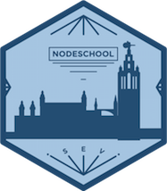

# NodeSchool en Sevilla

###Comienza con Node.js!
El [NodeSchool International Day](http://nodeschool.io/) es el **día 23 de Mayo** de 2015. Se organizan eventos por todo el mundo para animar a los desarrolladores a familiarizarse con Node.js. Si aún no te has animado a probar Node.js, estás de suerte porque ¡también se hará en Sevilla!

En este evento habrá una sesión de cómo comenzar con Node.js y sus principales ventajas pero la mayor parte del tiempo será practicando Node.js con los tutoriales de NodeSchool. En el evento participarán mentores que te ayudarán a entender y realizar los ejercicios.

El evento tendrá lugar en [República Argentina 31B, 1ª Planta, Módulo A](http://maps.google.com/maps?f=q&hl=en&q=Rep%C3%BAblica+Argentina%2C+31B%2C+1%C2%AA+Planta%2C+M%C3%B3dulo+A%2C+Sevilla%2C+es) a las **10:00 a.m.** donde [Bitnami](https://bitnami.com) nos ofrece sus instalaciones para poder realizar el evento: conexión a internet, televisión para presentaciones, pizarra, refrescos y .. ¡cerveza!

### Agenda

  - 10:00 Sesión de introducción a Node.js
  - 11:00 Aprendiendo Node.js con los tutoriales de NodeSchool
  - 13:30 Pizza time!

Stay tuned! Iremos publicando más novedades sobre el evento 

### Suena bien, ¿qué necesito?
Necesitarás tu portátil para hacer los ejemplos y te mostraremos cómo instalarlo en tu Sistema Operativo y las principales ventajas de Node.js.

### Pero yo ya he trabajado con Node.js
Si ya eres todo un experto con Node.js anímate y contacta con nosotros [abriendo un issue](https://github.com/nodeschool/seville/issues) para participar como mentor.

Contamos con mentores de la talla de:

* [Javier Baena](https://twitter.com/JvrBaena)
* Daniel Lopez
* [Álvaro Aroca](https://twitter.com/aarocatwitt)
* [Beltrán Rueda](https://twitter.com/beltranrubo)
* [Jorge Marín] (https://twitter.com/chipironcin)

### Genial! ¿Cómo me apunto?
Si lo que buscas es aprender apúntate desde hoy mismo en el [Meetup de Bitnami Sevilla](http://www.meetup.com/Bitnami-Sevilla/events/222186033/) y compártelo con tus amigos, colegas, etc. Seguro que a gente que conoces también le interesa.

### ¿Pero aún hay más?
Pues sí. Entre los participantes sortearemos 2 [BeagleBone](http://beagleboard.org/black) para demostrar a todo el mundo lo que eres capaz de hacer con Node.js.

Para cualquier pregunta o sugerencia puedes abrir un [issue en GitHub](https://github.com/nodeschool/seville/issues) o contactar con [@beltranrubo](https://twitter.com/beltranrubo).
